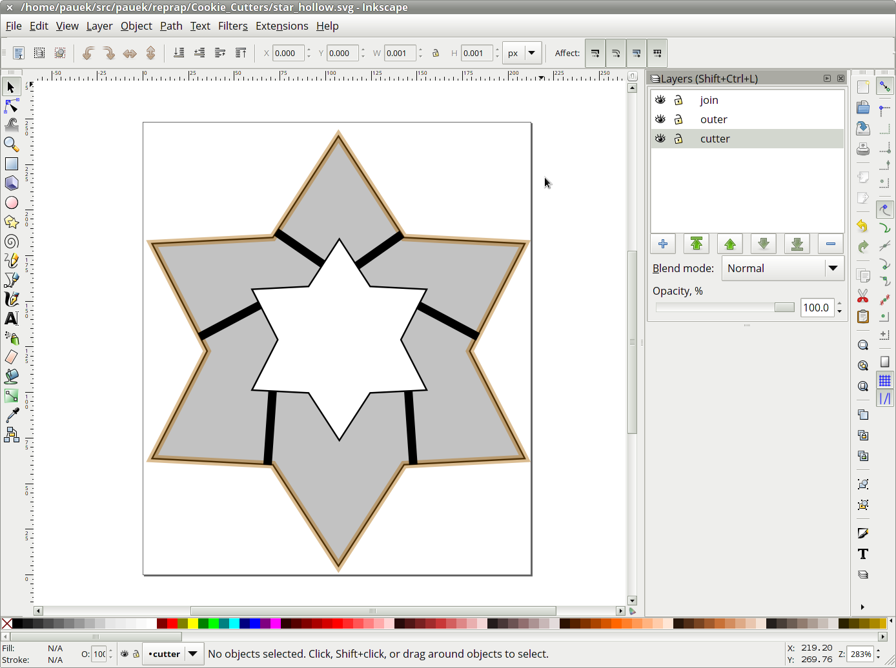
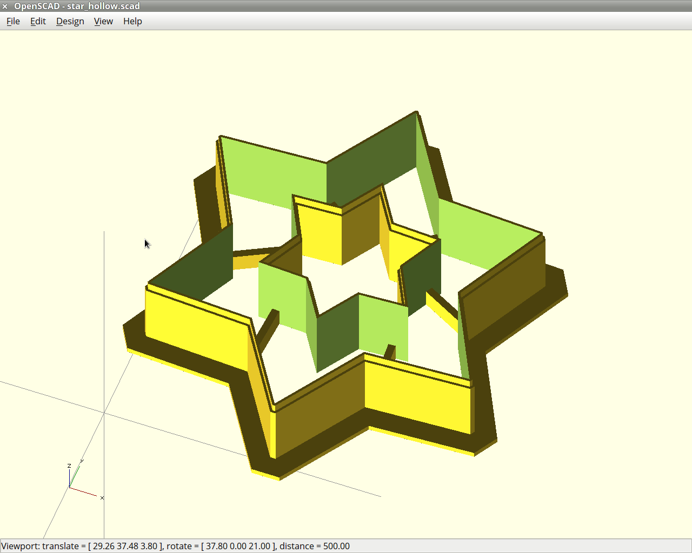

Cookie Cutters
==============

Cookie cutters in various shapes (+ scripts to make more), for those
of you that have a 3D printer.

0. Install the extension
------------------------

In the `contrib` directory there is an extension for Inkscape
([also on github](https://github.com/brad/Inkscape-OpenSCAD-DXF-Export))
that you have to install first. Copy all files
`$HOME/.config/inkscape/extensions` (no subdirs).

1. Draw the silhouette
----------------------

Create a SVG file in Inkscape with 3 layers: "cutter" (cutting parts),
"join" (unions between parts, optionally), "outer" (outer
silhouette). Mark the center on all three layers with a couple of
crossing lines (the script uses `dxf_cross` in OpenSCAD later to get
the center right, so this is very important). See the SVG files for some
examples.

2. Convert to DXF
-----------------

Save a copy of the file in DXF format. You should see "OpenSCAD DXF
Output (*.DXF)" as an option in the output format list.

3. Create an OpenSCAD file
--------------------------

The file should be something like:

    #include <cookie_cutter.scad>
    cookie_cutter("star.dxf", 15, 3.5, 0.4);
    
The module `cookie_cutter` has 4 parameters: *filename* (the DXF file
you exported before), *height* (in mm), *join height* (in mm), and
*nozzle_width*, so that you can adjust to you printer nozzle. (The
idea here is that the walls of the cutter will be sliced with 2 lines
and the final part will use 1 line, to make it sharper.)

If you need to **join** the diferent parts of the cutter, use
`cookie_cutter_join`:

    #include <cookie_cutter.scad>
    cookie_cutter_join("star_hollow.dxf", 15, 3.5, 0.4);

The difference between the two versions is just that the version with
`join` will use the "join" layer in the DXF and the other one won't.

4. Compile and export to STL
----------------------------

Compilation might be slow, since the`cookie_cutter` module uses
`minkowski` in several places. Export to STL, and then...

5. Print
--------

Enjoy!
